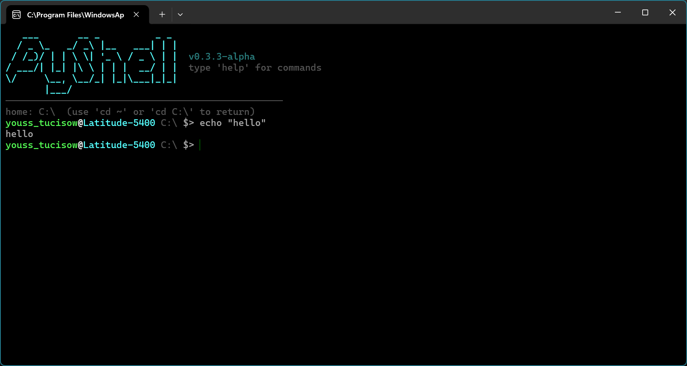

# PyShell — Python-Powered Shell

> A tiny, fast, cross-platform shell with powerlevel10k themes, prompt presets, pipes & real `.sh` scripting. Native on **Windows**, **Linux** & **macOS**.



**v0.9.3-alpha** · 24 built-ins · 13 themes (10 classic + 3 p10k) · 11 prompt presets + custom · pipes `|` · redirections `> >>` · chaining `; && ||` · history · startup commands

---

## What is PyShell?

PyShell (`pyshell.py`) is a **Python 3.10+ shell** that feels like Bash but runs everywhere without WSL/Cygwin. One file (`pyshell.py` + `pyshell_config.json`), one config, same commands on Windows (`C:\` home) and Linux/macOS (`~` home).

Use it as:
- **Daily interactive shell** (`python pyshell.py` or set as login shell via `chsh`)
- **Right-click “Open in terminal”** — respects the clicked folder (`pyshell.py:3762`)
- **Script runner** for `.sh` files with real `export`, `source`, `env`, globs, and variables

---

## Features

| Area | Details |
|------|---------|
| **Cross-platform** | `ls, cd, pwd, cat, echo, cp, mv, mkdir, rm, rmdir, touch, grep, export, unset, env, source, history, whoami, hostname, clear, time, help` + `pyshell` meta. Windows `C:\` ↔ Linux `~` handled at `pyshell.py:1030` |
| **Themes** | `dark, light, dracula, nord, monokai, solarized, matrix, ocean, sunset, neon, p10k, p10k_lean, p10k_rainbow` at `pyshell.py:207` — custom via `appearance.custom_themes`/`custom_colors` at `pyshell_config.json:37` |
| **Prompts** | `classic, pure, minimal, two-line, git, nerd, compact, full, p10k, powerline, time` at `pyshell.py:321` — placeholders `{user} {host} {cwd} {git} {p10k} {current_time} {time} {date}` + `time:true` flag at `pyshell.py:650` |
| **Config** | Single `pyshell_config.json:2` (validated at `pyshell.py:842`) — `prompt`, `history`, `behavior`, `aliases`, `appearance`, `startup` |
| **Refresh** | `pyshell --refresh / -r` + `refresh / ref / reload` at `pyshell.py:2097` — reloads config after manual edit like `source` (syncs `preset→format`, `theme→banner`) |
| **World game** | `world / openworld / cli-open-world / ow` at `pyshell.py:1995` — 6 maps `plains/desert/islands/forest/mountain/dungeon` unlock by LVL, `WASD`/arrows (right arrow fixed), `M` maps, `N/P` next/prev, `1-6` travel, auto-save to `Builtin/world_save.dat` (encoded, hidden, game-only) at `cli-open-world.py:17` |
| **Real .sh** | `; && || | > >> < & #`, `$VAR ${VAR:-default} $? $$ $HOME`, globs `*.py`, `VAR=val cmd`, `source script.sh`, background `&` at `pyshell.py:3711` |

---

## Quick Start

```bash
# Clone & run (no install)
git clone https://github.com/tuffgit21/PyShell.git
cd PyShell
python pyshell.py              # interactive
python pyshell.py --version    # version
python pyshell.py script.sh    # run .sh file
python pyshell.py -c "ls | grep py > out.txt"

# Set as login shell (Linux/macOS)
chmod +x pyshell.py
sudo chsh -s $(pwd)/pyshell.py $USER   # then re-login
# Windows Terminal: Settings → Default profile → Command line → python C:\path\to\pyshell.py
# Right-click “Open in terminal” now opens the clicked folder
```

---

## Commands

```
pyshell --version          # version + Python/host
pyshell quit / quit/exit/q # quit
pyshell config             # open pyshell_config.json
pyshell --refresh / -r     # reload config after manual edit
refresh / ref / reload     # alias
pyshell theme [list|set|preview]  # 13 presets, p10k configure
theme [list|set|preview]          # alias
p10k configure             # wizard
pyshell prompt [list|set|preview] # prompt presets
prompt / format [list|set|preview] # aliases
ls [path] / cd [path] / pwd / clear / cat / echo / time / whoami / hostname / help / history
cp / mv / mkdir / rm / rmdir / touch / grep / export / unset / env / source / .
rps                        # Rock Paper Scissors
world / openworld / ow     # CLI Open World (see below)
```

Full list: `help` inside PyShell or `pyshell_help.html`.

---

## Themes & Custom Themes

```bash
theme list                 # 13 + custom, ● current
theme set dracula
theme preview p10k_rainbow
p10k configure             # wizard → p10k/p10k_lean/p10k_rainbow
theme create mytheme dracula  # copies to appearance.custom_themes.mytheme
theme delete mytheme
```

`pyshell_config.json:37`:
```json
"appearance": {
  "theme": "dark",
  "banner_color": "bright_cyan",
  "custom_colors": {"user": "bright_magenta"},
  "custom_themes": {
    "mytheme": {"name":"Mytheme","banner":"bright_magenta","user":"bright_green","host":"bright_magenta","cwd":"dim","symbol":"bright_white","git":"bright_yellow","error":"bright_red","success":"bright_green"}
  }
}
```
Valid colors at `pyshell.py:70` `COLOR_MAP`: `black, red, green, yellow, blue, magenta, cyan, white, bright_*, bg_*, bg_bright_*`.

---

## Prompts & Current Time

```bash
prompt list                # classic, pure, minimal, two-line, git, nerd, compact, full, p10k, powerline, time
prompt preview time        # shows youss@host 16:51:26 ~/repo $>
prompt set time            # → {user}@{host} {current_time} {cwd} $>
format set "{user}@{host} {current_time} {cwd} $> "  # custom
format create myprompt "{user}:{cwd} ❯ "
```

Placeholders at `pyshell.py:3842`: `{user} {host} {cwd} {git} {p10k} {current_time} {time} {date}` (`time` alias, `date` is `YYYY-MM-DD`). Also boolean at `pyshell.py:650`:
```json
"prompt": {"preset":"classic","format":"{user}@{host} {cwd} $> ","time": true}
```
→ auto-prepends `HH:MM:SS` even if format has no placeholder (`pyshell.py:3840`).

Custom prompt at `pyshell_config.json:2` `prompt.custom_formats`.

---

## World — CLI Open World

```bash
world                      # start (auto-loads save)
world --list-maps          # plains0 desert1 islands2 forest3 mountain4 dungeon5
world --map desert         # start on map
world --new                # ignore save, fresh
world --stats              # show saved LVL/XP/ATK
world --delete-save        # delete save
```

*In-game:* `WASD` / arrows walk (right arrow fixed at `cli-open-world.py:43`), `J` stats, `L` look, `M` maps menu (`1-6`/`N`/`P`/`WASD` select), `N` next, `P` prev, `1-6` direct travel, `Q` quit (auto-saves). Edge walk → `N→desert` hint at `cli-open-world.py:464`. Maps unlock by level: `plains0 desert1 islands2 forest3 mountain4 dungeon5` at `cli-open-world.py:34`.

Saves: `Builtin/world_save.dat:17` — `PYSHELLWORLD:` + `SHA256` + `XOR` + `base64` + `reverse`, hidden+system (`0x02|0x04`) at `cli-open-world.py:221`, plain `world_save.json` rejected/deleted at `cli-open-world.py:318` (game-only).

On death at `cli-open-world.py:430`: keep `LVL/XP` (`-20 XP` penalty), `ATK/max_health`, respawn `0,0` town, `save_game()` (not deleted).

---

## Config — `pyshell_config.json`

```json
{
  "prompt": {"format":"{user}@{host} {current_time} {cwd} $> ","preset":"time","color":true,"git_branch":false,"time":false,"custom_formats":{}},
  "history": {"file":"~/.pyshell_history","max_lines":500,"save_on_exit":true},
  "behavior": {"clear_on_start":false,"confirm_exit":false,"expand_tilde":true},
  "aliases": {"ll":"ls","la":"ls -a","hist":"history"},
  "appearance": {"banner":true,"banner_color":"bright_cyan","theme":"dark","custom_colors":{},"custom_themes":{}},
  "startup": {"commands":["echo \"welcome to PyShell\""]}
}
```

* `startup.commands` at `pyshell.py:3885` — auto-run any built-in on launch (like `echo`).
* After manual edit: `pyshell --refresh` / `ref` at `pyshell.py:2097` reloads and syncs `preset→format` + `theme→banner` at `pyshell.py:3840`.
* `Open in terminal` (right-click) at `pyshell.py:3762` respects clicked folder (`cwd` or `argv[1]` dir), not forced to `~`/`C:\`.

---

## Site & Help

* `index.html` — landing, screenshots (`screenshots.json`), socials, updates
* `pyshell_help.html` — 24 commands, search `/`, categories, `terminal-tip` (`WASD`, `M maps` at `pyshell_help.html:243`)
* `style.css:1559` — responsive: `400px/360px` fixes, `overflow-x:hidden`, `screenshot-wrapper` mobile scroll
* `script.js:2` — `PYSHELL_VERSION` single source

---

## Development

```bash
python -m py_compile pyshell.py           # check
python -m py_compile Builtin/cli-open-world.py
# Add builtin: add to BUILTINS:2657, CMD_LIST:995, dispatch:3433, help, tab complete:3754
```
 # About macOS version

PyShell currently supports Windows and Linux. macOS is not officially supported yet.

If you have a Mac and would like to help bring PyShell to macOS, feel free to fork the project, test it on macOS, and open a pull request or let me know about your changes.
## License & Credits

Made by **tuffgit21** — [GitHub](https://github.com/tuffgit21) · [Site](https://tuffgit21.github.io/PyShell/) · [Help](https://tuffgit21.github.io/PyShell/pyshell_help.html)

PyShell `v1.0.0` — contributions welcome.
